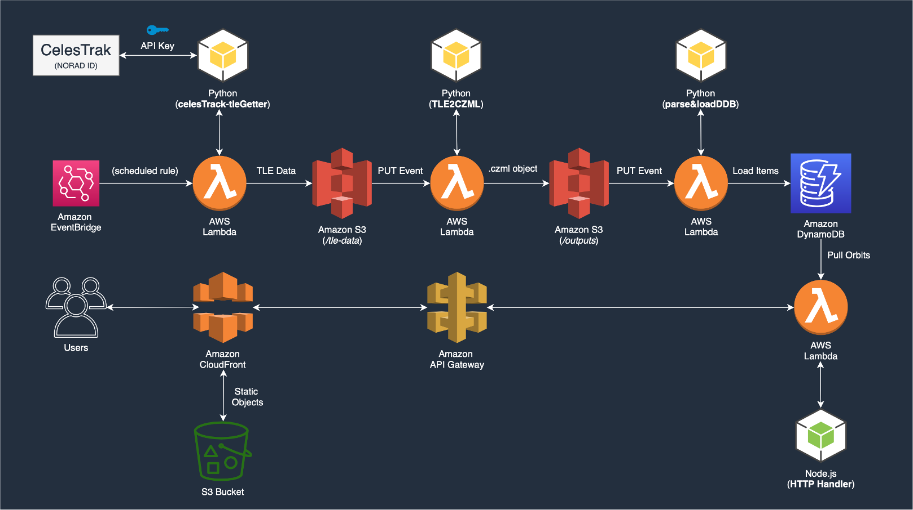
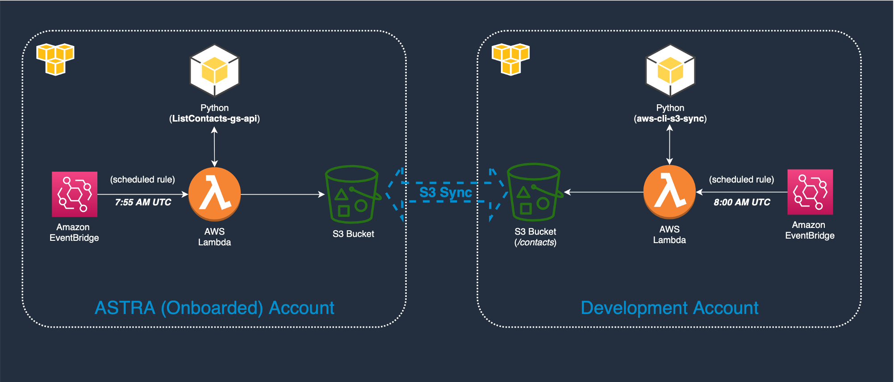
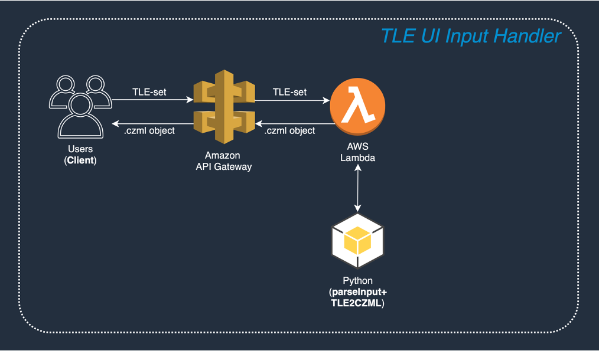
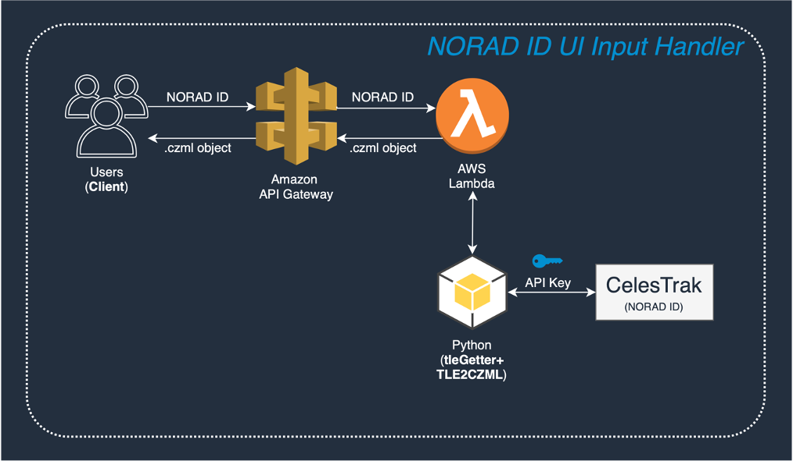

# 🛰️ Orbital-Vision — Satellite Tracking & Orbit Visualization on AWS

A serverless application that fetches satellite **Two-Line Element (TLE)** data,
computes orbital paths, schedules **AWS Ground Station** contacts across multiple
regions, and serves orbit data for 3D visualization (CesiumJS / CZML).

Built on a fully event-driven AWS architecture — S3 triggers, Lambda functions,
DynamoDB, and API Gateway — to turn raw orbital data from
[space-track.org](https://www.space-track.org) into interactive, time-dynamic
satellite orbit visualizations for AQUA, NOAA, and SNPP satellites.

---

## Architecture



The pipeline:

1. **Fetch TLE data** — a scheduled Lambda logs into space-track.org and pulls the
   latest TLE for each tracked satellite, writing it to S3.
2. **Convert to orbits** — an S3 PUT event triggers a Lambda that converts TLE data
   into **CZML** (Cesium's time-dynamic scene format).
3. **Store orbits** — another S3 trigger loads the generated CZML into DynamoDB,
   keyed by satellite and timestamp.
4. **Serve orbits** — an API Gateway + Lambda endpoint returns the latest orbit
   CZML for a requested NORAD ID, consumed by the front-end visualization.
5. **UI input handlers** — API endpoints let a user supply either a NORAD ID or a
   raw TLE and get back a computed orbit on demand.

### Ground Station contact scheduling


A Lambda queries **AWS Ground Station** (`list_contacts`) across multiple ground
stations/regions to find available satellite contact windows and syncs the
results to S3.

### On-demand UI input handlers



---

## Lambda functions

| Function | Runtime | Trigger | What it does |
|----------|---------|---------|--------------|
| [`tle-getter`](lambdas/tle-getter/) | Python | Scheduled | Logs into space-track.org and writes latest TLE for AQUA / NOAA / SNPP to S3 |
| [`tle2czml`](lambdas/tle2czml/) | Python | S3 PUT (TLE) | Converts TLE text into CZML orbit files and uploads them to S3 |
| [`load-dynamodb`](lambdas/load-dynamodb/) | Python | S3 PUT (CZML) | Parses generated CZML and stores orbit records in DynamoDB |
| [`get-orbits`](lambdas/get-orbits/) | Node.js | API Gateway | Returns the latest orbit CZML for a given NORAD ID |
| [`tle-input-handler`](lambdas/tle-input-handler/) | Python | API Gateway | Computes an orbit on demand from a user-supplied TLE |
| [`noradid-input-handler`](lambdas/noradid-input-handler/) | Python | API Gateway | Fetches a TLE by NORAD ID and computes its orbit on demand |
| [`s3-sync-contacts`](lambdas/s3-sync-contacts/) | Python | — | Syncs Ground Station contact data between S3 buckets via the AWS CLI layer |

## Tech stack

`AWS Lambda (Python & Node.js)` · `Amazon S3` · `Amazon DynamoDB` ·
`Amazon API Gateway` · `AWS Ground Station` · `CesiumJS / CZML` ·
`space-track.org API` · `tle2czml`

---

## Repository structure

```
Orbital-Vision/
├── lambdas/
│   ├── tle-getter/            # fetch TLE from space-track.org  → S3
│   ├── tle2czml/              # TLE → CZML orbit files          (S3 trigger)
│   ├── load-dynamodb/         # CZML → DynamoDB                 (S3 trigger)
│   ├── get-orbits/            # serve orbit CZML by NORAD ID    (API GW)
│   ├── tle-input-handler/     # on-demand orbit from a TLE      (API GW)
│   ├── noradid-input-handler/ # on-demand orbit from a NORAD ID (API GW)
│   └── s3-sync-contacts/      # sync Ground Station contacts
├── OV_architectures/          # architecture diagrams
├── SLTrack.ini.example        # space-track.org credential template
└── README.md
```

---

## Configuration

The TLE-fetching functions authenticate to space-track.org using a credentials
file. Copy the template and fill in your own credentials:

```bash
cp SLTrack.ini.example SLTrack.ini
# edit SLTrack.ini with your space-track.org username/password
```

`SLTrack.ini` is gitignored — **credentials are never committed.**

---

## Notes

- The satellites tracked by default are **AQUA** (NORAD 27424), **SNPP**
  (NORAD 37849), and **NOAA-20** (NORAD 43013).
- Each Lambda here is the hand-written handler source; at deploy time these are
  bundled with their Python/Node dependencies into Lambda deployment packages.
- Orbit data is produced as **CZML**, designed to be rendered in a CesiumJS globe
  for interactive, time-dynamic 3D orbit visualization.

---

## Author

**Walid El Khatib** — [GitHub @walidelkhatib](https://github.com/walidelkhatib)
